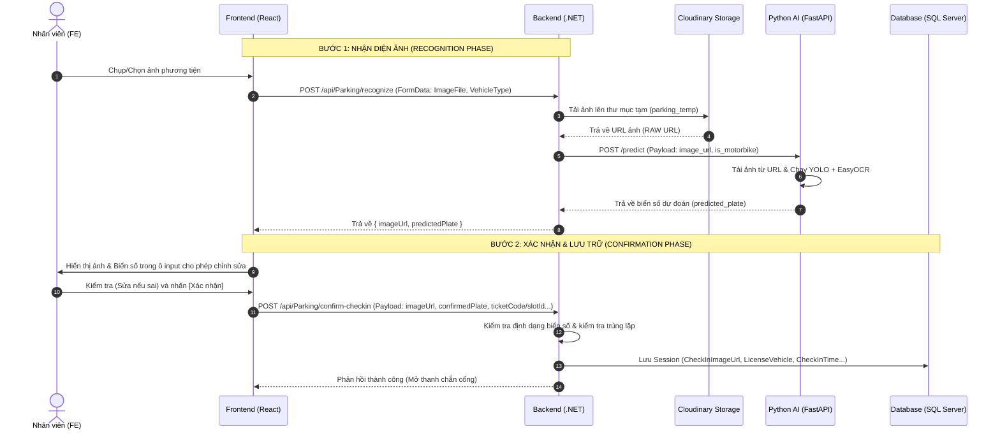

# Quy trình nhận diện và xác nhận biển số xe (ALPR Workflow)

Tài liệu này hướng dẫn chi tiết cách thiết lập và tối ưu hóa luồng nhận diện biển số xe từ **Frontend (React)** qua **Backend (.NET)**, kết nối với **Python AI (YOLO + EasyOCR)** và lưu trữ trên **Cloudinary**.

---

## 1. Sơ đồ tuần tự (Sequence Diagram)



---

## 2. Đánh giá độ ổn định và bảo mật của Cloudinary (Cloudinary Stability Audit)

Qua rà soát mã nguồn `CloudinaryStorageService.cs` hiện tại, hệ thống đang chạy ổn định nhưng cần lưu ý **5 điểm chí mạng** sau để tránh lỗi hệ thống khi vận hành thực tế:

### Lỗi 1: Trình đọc ảnh Python (`cv2.imdecode`) bị lỗi khi giải mã định dạng động (`f_auto`)
* **Nguyên nhân**: Hiện tại BE đang cấu hình: `.Transform(new Transformation().Quality("auto").FetchFormat("auto"))`. Tham số `f_auto` (Fetch Format Auto) sẽ điều hướng Cloudinary trả về định dạng ảnh tốt nhất dựa vào header `Accept` của client. Khi Python AI gọi `requests.get(url)`, nếu Cloudinary trả về **AVIF** hoặc **WebP**, thư viện OpenCV (`cv2`) trong Python nếu không được biên dịch kèm hỗ trợ định dạng này sẽ giải mã thất bại (`cv2.imdecode` trả về `None`), làm sập API AI.
* **Giải pháp**: 
  1. Khi gửi URL sang Python AI, Backend phải gửi **URL gốc (Raw URL)** hoặc chỉ định rõ định dạng tương thích cao như JPG/PNG (dùng `.Transform(new Transformation().Quality("auto").FetchFormat("jpg"))`).
  2. Đối với Frontend hiển thị, mới áp dụng `f_auto,q_auto` để tối ưu dung lượng và tăng tốc tải trang.

### Lỗi 2: Rò rỉ lưu trữ (Storage Bloat) do ảnh rác
* **Nguyên nhân**: Người dùng có thể chụp ảnh nhưng sau đó hủy bỏ (không nhấn xác nhận lưu). Nếu ảnh được upload trực tiếp lên Cloudinary ở bước 1, các ảnh này sẽ tồn tại vĩnh viễn trên Cloudinary gây tốn chi phí.
* **Giải pháp**:
  - Upload ảnh ở bước nhận dạng vào một thư mục tạm trên Cloudinary (Ví dụ: `parking_temp`).
  - Thiết lập **Upload Presets** hoặc cài đặt **Media Library Lifecycle Rule** trên trang quản trị Cloudinary để tự động xóa sạch các file trong thư mục `parking_temp` sau 24 giờ.
  - Khi người dùng bấm **Xác nhận (Confirm)**, Backend .NET sẽ thực hiện đổi tên (rename) hoặc di chuyển file từ `parking_temp/public_id` sang thư mục lưu trữ vĩnh viễn `parking_checkin/` hoặc `parking_checkout/`.

### Lỗi 3: Nghẽn đồng bộ (Blocking IO) khi Cloudinary phản hồi chậm
* **Nguyên nhân**: Việc tải ảnh lên Cloudinary là một tác vụ I/O mạng bên ngoài. Nếu kết nối từ máy chủ Backend sang Cloudinary bị nghẽn, API Check-in của bạn sẽ bị treo (timeout), khiến xe cộ bị ùn tắc tại cổng.
* **Giải pháp**:
  - Sử dụng cơ chế `CancellationToken` với timeout ngắn (ví dụ: tối đa 8-10 giây) cho các tác vụ tải lên Cloudinary.
  - Cấu hình thư viện **Polly** trong .NET để tự động thử lại (Retry) tối đa 2 lần nếu gặp lỗi mạng tạm thời trước khi báo lỗi cho người dùng.

---

## 3. Hướng dẫn triển khai code chi tiết (Implementation Guide)

### 3.1. Phía Python AI (FastAPI)

Cần cấu hình hàm tải ảnh để chịu tải tốt hơn và tránh bị Cloudinary chặn hoặc trả về định dạng lạ.

*Cập nhật file `app/api/predict.py`:*

```python
def get_image_from_url(url: str) -> np.ndarray:
    headers = {
        # Giả lập trình duyệt để tránh bị chặn và yêu cầu định dạng tương thích cao
        "User-Agent": "Mozilla/5.0 (Windows NT 10.0; Win64; x64) AppleWebKit/537.36 (KHTML, like Gecko) Chrome/120.0.0.0 Safari/537.36",
        "Accept": "image/jpeg,image/png,image/*;q=0.8"
    }
    
    # Thiết lập timeout hợp lý (ví dụ: 10 giây) để tránh treo API khi Cloudinary gặp sự cố
    response = requests.get(url, headers=headers, timeout=10)
    
    if response.status_code != 200:
        raise Exception(f"Không thể tải ảnh từ URL Cloudinary. HTTP Code: {response.status_code}")
    
    image_bytes = np.frombuffer(response.content, dtype=np.uint8)
    image = cv2.imdecode(image_bytes, cv2.IMREAD_COLOR)
    
    if image is None:
        raise Exception("Không thể giải mã định dạng ảnh. Hãy chắc chắn URL trả về định dạng JPG/PNG.")
    
    return image
```

---

### 3.2. Phía Backend (.NET)

#### Bước A: Sửa đổi Interface và Service của Cloudinary để giữ tính tương thích ngược

*Mở file `IImageStorageService.cs`:*

```csharp
using Microsoft.AspNetCore.Http;
using System.Threading.Tasks;

namespace ParkingBuilding.Service.IService
{
    public class CloudinaryUploadResult
    {
        public string RawUrl { get; set; }        // Dùng để lưu DB và gửi cho Python AI
        public string OptimizedUrl { get; set; }  // Dùng để trả về hiển thị mượt trên FE
        public string PublicId { get; set; }
    }

    public interface IImageStorageService
    {
        // Giữ nguyên hàm cũ để các chức năng khác không bị ảnh hưởng
        Task<string> UploadImageAsync(IFormFile file, string folderName);

        // Hàm mới trả về thông tin chi tiết
        Task<CloudinaryUploadResult> UploadImageDetailedAsync(IFormFile file, string folderName);
    }
}
```

*Mở file `CloudinaryStorageService.cs` và thêm hàm triển khai:*

```csharp
        public async Task<CloudinaryUploadResult> UploadImageDetailedAsync(IFormFile file, string folderName)
        {
            if (file == null || file.Length == 0)
            {
                throw new ArgumentException("Tập tin hình ảnh không hợp lệ.");
            }

            var allowedExtensions = new[] { ".jpg", ".jpeg", ".png", ".webp", ".heic", ".heif", ".bmp" };
            var extension = Path.GetExtension(file.FileName).ToLowerInvariant();
            if (!allowedExtensions.Contains(extension))
            {
                throw new ArgumentException("Định dạng file không được hỗ trợ.");
            }

            using var memoryStream = new MemoryStream();
            await file.CopyToAsync(memoryStream);
            memoryStream.Position = 0;

            var uploadParams = new ImageUploadParams()
            {
                File = new FileDescription(file.FileName, memoryStream),
                Folder = folderName
            };

            var uploadResult = await _cloudinary.UploadAsync(uploadParams);
            if (uploadResult.Error != null)
            {
                throw new Exception($"Lỗi upload Cloudinary: {uploadResult.Error.Message}");
            }

            // URL gốc không qua nén chất lượng quá đà
            string rawUrl = _cloudinary.Api.UrlImgUp.BuildUrl(uploadResult.PublicId);

            // URL tối ưu hóa định dạng cho Frontend
            string optimizedUrl = _cloudinary.Api.UrlImgUp
                .Transform(new Transformation().Quality("auto").FetchFormat("auto"))
                .BuildUrl(uploadResult.PublicId);

            return new CloudinaryUploadResult
            {
                RawUrl = rawUrl,
                OptimizedUrl = optimizedUrl,
                PublicId = uploadResult.PublicId
            };
        }
```

#### Bước B: Tạo Endpoint Nhận dạng Mới `/api/Parking/recognize` trong `ParkingController.cs`

Tách biệt luồng nhận dạng ảnh ra khỏi luồng lưu database.

```csharp
        [Authorize(Roles = "Staff")]
        [HttpPost("recognize")]
        public async Task<IActionResult> RecognizePlate([FromForm] IFormFile imageFile, [FromForm] int vehicleTypeId)
        {
            try
            {
                if (imageFile == null || imageFile.Length == 0)
                    return BadRequest(new { isSuccess = false, message = "Vui lòng cung cấp file ảnh phương tiện." });

                // 1. Upload lên thư mục tạm của Cloudinary
                var uploadResult = await _imageStorageService.UploadImageDetailedAsync(imageFile, "parking_temp");

                // 2. Gọi dịch vụ Python AI bằng URL gốc (RawUrl)
                bool isMotorbike = (vehicleTypeId == 2);
                
                string detectedPlate = "";
                try 
                {
                    detectedPlate = await _aiRecognitionService.PredictLicensePlateAsync(uploadResult.RawUrl);
                }
                catch (Exception aiEx)
                {
                    return Ok(new {
                        isSuccess = true,
                        imageUrl = uploadResult.OptimizedUrl,
                        rawImageUrl = uploadResult.RawUrl,
                        predictedPlate = "",
                        message = $"Không thể nhận dạng tự động: {aiEx.Message}. Vui lòng nhập tay."
                    });
                }

                return Ok(new {
                    isSuccess = true,
                    imageUrl = uploadResult.OptimizedUrl,
                    rawImageUrl = uploadResult.RawUrl,
                    predictedPlate = detectedPlate
                });
            }
            catch (Exception ex)
            {
                return BadRequest(new { isSuccess = false, message = ex.Message });
            }
        }
```

#### Bước C: Tạo Endpoint Xác nhận Cổng Vào `/api/Parking/confirm-checkin`

Nhận kết quả cuối cùng từ FE gửi lên và lưu chính thức vào DB.

```csharp
    public class ConfirmCheckInRequest
    {
        public string ImageUrl { get; set; }      // Raw URL nhận từ bước nhận diện
        public string ConfirmedPlate { get; set; } // Biển số cuối cùng sau khi kiểm tra
        public string? TicketCode { get; set; }   // Mã vé (nếu có)
        public int VehicleTypeId { get; set; }    // Loại xe
    }

    [Authorize(Roles = "Staff")]
    [HttpPost("confirm-checkin")]
    public async Task<IActionResult> ConfirmCheckIn([FromBody] ConfirmCheckInRequest request)
    {
        try
        {
            if (!ParkingBuilding.Service.Service.Helpers.LicensePlateHelper.IsValidLicensePlate(request.ConfirmedPlate, out string validatedPlate))
            {
                return BadRequest(new { isSuccess = false, message = ParkingBuilding.Service.Service.Helpers.LicensePlateHelper.GetErrorMessage() });
            }

            // Gọi logic lưu check-in vãng lai hoặc check-in đặt trước của CheckInService vào database
            var isSuccess = await _checkInService.SaveConfirmedCheckInAsync(validatedPlate, request.ImageUrl, request.TicketCode, request.VehicleTypeId);

            if (isSuccess)
            {
                return Ok(new { isSuccess = true, message = "Check-in thành công! Mở thanh chắn cổng." });
            }

            return BadRequest(new { isSuccess = false, message = "Check-in thất bại. Không tìm thấy thông tin phù hợp." });
        }
        catch (Exception ex)
        {
            return BadRequest(new { isSuccess = false, message = ex.Message });
        }
    }
```

---

### 3.3. Phía Giao diện Frontend (React + Ant Design)

#### Bước 1: Khai báo các hàm kết nối API mới trong `parkingService.js`

```javascript
  recognizeLicensePlate: async (imageFile, vehicleTypeId) => {
    try {
      const formData = new FormData();
      formData.append("imageFile", imageFile);
      formData.append("vehicleTypeId", vehicleTypeId);

      const response = await api.post('/Parking/recognize', formData, {
        headers: { 'Content-Type': 'multipart/form-data' }
      });
      return response.data;
    } catch (error) {
      const serverMessage = error.response?.data?.message || "Nhận diện ảnh thất bại.";
      throw serverMessage;
    }
  },

  confirmCheckIn: async (payload) => {
    try {
      const response = await api.post('/Parking/confirm-checkin', payload);
      return response.data;
    } catch (error) {
      const serverMessage = error.response?.data?.message || "Xác nhận check-in thất bại.";
      throw serverMessage;
    }
  },
```

#### Bước 2: Cập nhật file `GateController.jsx` để kết nối luồng

*Tại hàm `onUpload` của bộ chọn ảnh:*

```javascript
              onUpload={async (file) => {
                const localUrl = URL.createObjectURL(file);
                setEntryImagePreviewUrl(localUrl);
                setEntryWebcamOn(false);
                setEntryScanning(true);
                setEntryOcrResult(null);
                
                try {
                  const type = checkInForm.getFieldValue('type') || 'Car';
                  const typeId = VEHICLE_TYPE_MAP[type] || 3;
                  
                  const result = await parkingService.recognizeLicensePlate(file, typeId);
                  
                  if (result && result.isSuccess) {
                    setEntryOcrResult(result.predictedPlate);
                    setEntryImagePreviewUrl(result.imageUrl);
                    checkInForm.setFieldsValue({ 
                      plate: result.predictedPlate,
                      tempImageUrl: result.rawImageUrl
                    });
                    message.success(`AI nhận diện: ${result.predictedPlate}`);
                  } else {
                    message.error(result.message || "Không thể nhận dạng.");
                  }
                } catch (err) {
                  message.error(String(err));
                } finally {
                  setEntryScanning(false);
                }
              }}
```

*Tại hàm `handleCheckInSubmit` gửi đi:*

```javascript
  const handleCheckInSubmit = async (values) => {
    try {
      const payload = {
        imageUrl: values.tempImageUrl || "string",
        confirmedPlate: values.plate.trim().toUpperCase(),
        ticketCode: checkInMode === 'reservation' ? values.ticketCode : null,
        vehicleTypeId: VEHICLE_TYPE_MAP[values.type] || 3
      };

      const response = await parkingService.confirmCheckIn(payload);
      
      if (response && response.isSuccess) {
        message.success(response.message || "Xác nhận Check-in thành công!");
        
        checkInForm.resetFields();
        if (entryImagePreviewUrl) {
          URL.revokeObjectURL(entryImagePreviewUrl);
          setEntryImagePreviewUrl(null);
        }
        setEntryOcrResult(null);
        fetchActiveParkedVehicles();
      } else {
        message.error(response?.message || "Check-in thất bại.");
      }
    } catch (err) {
      console.error("Check-in Error:", err);
      message.error(err.message || String(err));
    }
  };
```

*Cập nhật Form hiển thị trường ẩn và trường hiển thị:*

```jsx
            <Form
              form={checkInForm}
              layout="vertical"
              onFinish={handleCheckInSubmit}
              requiredMark={false}
              className="space-y-3"
            >
              <Form.Item name="tempImageUrl" noStyle>
                <Input type="hidden" />
              </Form.Item>

              {checkInMode === 'reservation' && (
                <Form.Item
                  name="ticketCode"
                  label={<span className="text-slate-500 text-xs font-bold uppercase tracking-wider">Ticket / QR Code</span>}
                  rules={[{ required: true, message: 'Vui lòng quét hoặc nhập mã vé!' }]}
                  className="mb-3"
                >
                  <Input placeholder="e.g. QR_B5F9A1D8" className="h-10 bg-slate-50 border-slate-200 text-slate-800 rounded-lg font-mono uppercase font-bold" />
                </Form.Item>
              )}

              <Form.Item
                name="plate"
                label={<span className="text-slate-500 text-xs font-bold uppercase tracking-wider">Biển Số Xe (Kiểm tra và sửa lại nếu AI sai)</span>}
                rules={[{ required: true, message: 'Vui lòng nhập biển số xe!' }]}
                className="mb-3"
              >
                <Input placeholder="e.g. 30A-123.45" className="h-10 bg-slate-50 border-slate-200 text-slate-800 rounded-lg font-mono uppercase font-bold focus:border-indigo-500" />
              </Form.Item>
```

---

## 4. Bảng so sánh Luồng cũ và Luồng mới đề xuất

| Tiêu chí so sánh | Luồng Cũ (Xử lý gộp 1 bước) | Luồng Mới Đề Xuất (Tách biệt 2 bước) |
| :--- | :--- | :--- |
| **Độ chính xác biển số** | Thấp hơn (Nếu AI nhận diện sai chữ số, DB sẽ lưu sai hoàn toàn và không thể checkout đối khớp). | **Tuyệt đối** (Nhân viên soát vé đóng vai trò lớp kiểm duyệt cuối cùng, sửa lỗi OCR tức thì). |
| **Trải nghiệm khách hàng**| Gặp nhiều sự cố tranh cãi ở cổng ra do biển số lưu sai không khớp biển số thực tế. | Trơn tru, giảm thiểu tỷ lệ kẹt xe do sai lệch dữ liệu. |
| **Xử lý ảnh Cloudinary**  | Gửi URL nén `f_auto` làm Python AI không giải mã được hoặc giải mã mờ làm giảm độ chính xác OCR. | Gửi **Raw URL** chất lượng gốc cho Python AI, gửi **Optimized URL** cho FE hiển thị nhanh. |
| **Quản lý rác bộ nhớ** | Upload lưu vĩnh viễn dù giao dịch có bị hủy giữa chừng. | Upload vào thư mục tạm `parking_temp` có TTL tự động xóa, chỉ lưu vĩnh viễn khi đã bấm xác nhận. |
