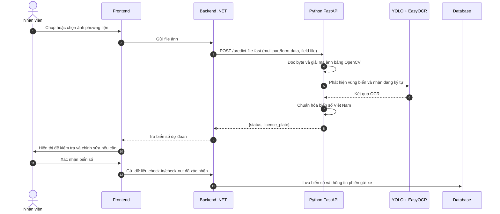

# Quy trình nhận diện và xác nhận biển số xe

Tài liệu này mô tả luồng hiện tại từ Frontend qua Backend .NET đến dịch vụ Python AI. Backend gửi trực tiếp file ảnh sang AI; Cloudinary không tham gia bước nhận diện.

## 1. Sơ đồ tuần tự



## 2. Hợp đồng API giữa Backend và Python AI

### Request

```http
POST /predict-file-fast
Content-Type: multipart/form-data
```

Tên field chứa ảnh bắt buộc là `file`.

```bash
curl -X POST "http://127.0.0.1:8000/predict-file-fast" \
  -F "file=@vehicle.jpg"
```

### Response thành công

```json
{
  "status": "success",
  "license_plate": "59X312345"
}
```

### Response thất bại

```json
{
  "status": "error",
  "message": "Không phát hiện thấy biển số xe"
}
```

Backend phải đọc trường `license_plate`. Dịch vụ AI không trả trường `predicted_plate`.

## 3. Các bước xử lý bên trong AI

1. FastAPI nhận `UploadFile` và đọc dữ liệu ảnh.
2. OpenCV giải mã byte thành ma trận ảnh BGR.
3. Ảnh lớn được thu nhỏ để giảm thời gian suy luận.
4. YOLO phát hiện các vùng biển số và chọn bounding box có confidence cao nhất.
5. Vùng biển số được mở rộng nhẹ, cắt khỏi ảnh, sửa nghiêng và tăng tương phản.
6. EasyOCR đọc các ký tự trong tập `0-9` và `A-Z`.
7. Hậu xử lý sắp xếp một dòng/hai dòng, lọc confidence thấp và sửa lỗi OCR thường gặp.
8. Ứng viên phù hợp nhất với cấu trúc biển số Việt Nam được trả cho Backend.

## 4. Phân chia trách nhiệm

- Frontend chụp/chọn ảnh và cho nhân viên kiểm tra kết quả.
- Backend điều phối nghiệp vụ, gửi file sang AI và lưu dữ liệu đã xác nhận.
- Python AI chỉ nhận diện ảnh và trả chuỗi biển số.
- Nếu cần lưu ảnh, Backend xử lý lưu trữ độc lập sau hoặc song song với nhận diện; AI không tải ảnh từ dịch vụ lưu trữ.
