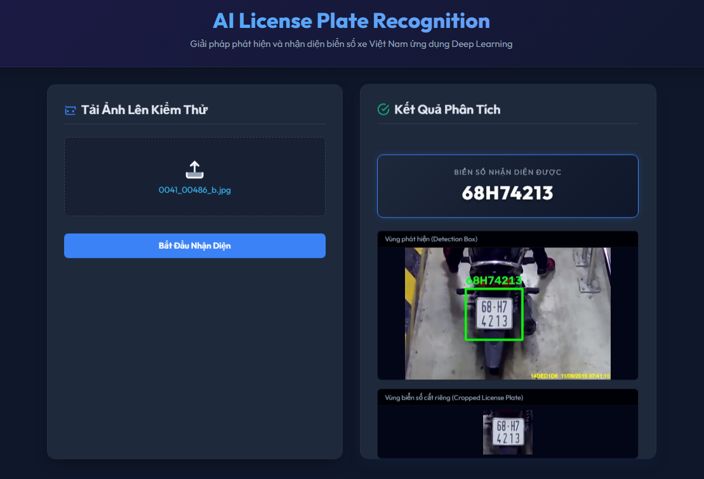

<div align="center">

# 🚘 Parking Building License Plate AI

### Fast detection, accurate recognition, seamless integration

An Automatic License Plate Recognition (ALPR) service for Vietnamese license plates, built with FastAPI, YOLOv8, and EasyOCR.

[](https://www.python.org/)
[](https://fastapi.tiangolo.com/)
[](https://github.com/ultralytics/ultralytics)
[](https://www.docker.com/)
[](https://github.com/ParkingBuildingManagementSystem-SWP391/ParkingBuildingLicensePlateAI)
[](#-license--contact)

[About](#-about-the-project) •
[Features](#-key-features) •
[Getting Started](#-getting-started) •
[API Usage](#-usage) •
[Technical Flow](LicensePlateRecognitionFlow.md)

</div>

---

## 🚀 About The Project

**Parking Building License Plate AI** is an independent AI microservice designed for a parking management system. A .NET Backend sends a vehicle image directly to FastAPI, which detects the license plate region, recognizes its characters, and returns a normalized Vietnamese license plate number.

The recognition flow does not depend on Cloudinary or another intermediate image storage service:

```text
Frontend → .NET Backend → FastAPI → YOLOv8 → Image Processing
                                      → EasyOCR → Plate Normalization → Backend
```

> **Architecture note:** The AI service is responsible only for recognition. Result confirmation, image storage, and parking-session persistence belong to the Backend.

### Recognition Pipeline

1. FastAPI receives an image through `multipart/form-data`.
2. OpenCV decodes and resizes the input image when necessary.
3. YOLOv8 detects the license plate region with the highest confidence.
4. The plate is cropped, deskewed, contrast-enhanced, and denoised.
5. EasyOCR recognizes characters using the `0-9` and `A-Z` allowlist.
6. Post-processing rules normalize the result according to Vietnamese plate formats.
7. The API returns the `license_plate` field to the Backend.

---

## 🛠️ Built With

| Technology | Purpose |
|---|---|
| **Python 3.11** | Primary programming language |
| **FastAPI** | Asynchronous REST API framework |
| **Uvicorn** | ASGI application server |
| **Ultralytics YOLOv8** | License plate region detection |
| **EasyOCR** | Character recognition |
| **OpenCV** | Image decoding, cropping, deskewing, and preprocessing |
| **NumPy** | Image data representation and manipulation |
| **PyTorch** | AI model runtime |
| **Jinja2** | Web Dashboard rendering |
| **Docker** | Consistent packaging and deployment |

---

## ✨ Key Features

- 🔍 **Automatic license plate detection** powered by YOLOv8.
- 🔤 **Character recognition** using EasyOCR and a restricted character set.
- 🇻🇳 **Vietnamese plate normalization** for both one-line and two-line formats.
- 🧹 **Specialized image preprocessing** with deskewing, CLAHE, Otsu thresholding, and morphology.
- ⚡ **Fast mode** to reduce OCR calls and response time.
- 🧠 **Smart candidate selection** based on plate validity and OCR confidence.
- 🔌 **Backend-optimized API** that accepts image files and returns lightweight JSON.
- 🖼️ **Visual Dashboard** showing the recognized plate, detection box, and cropped region.
- 🔥 **Model warm-up** to reduce latency on the first real request.
- 🐳 **Docker-ready deployment** with Hugging Face Spaces support.
- ✅ **Unit tests** for image preprocessing and plate normalization rules.

---

## 🏁 Getting Started

### Prerequisites

Install the following tools before continuing:

- [Python 3.11+](https://www.python.org/downloads/)
- [Git](https://git-scm.com/)
- [Docker](https://www.docker.com/) — optional

> **Recommendation:** Use a virtual environment. Enabling `OCR_GPU = True` requires a compatible NVIDIA GPU and CUDA-enabled PyTorch environment.

### 1. Clone the Repository

```bash
git clone https://github.com/ParkingBuildingManagementSystem-SWP391/ParkingBuildingLicensePlateAI.git
cd ParkingBuildingLicensePlateAI
```

### 2. Create a Virtual Environment

**Windows PowerShell**

```powershell
python -m venv .venv
.\.venv\Scripts\Activate.ps1
```

**Linux / macOS**

```bash
python3 -m venv .venv
source .venv/bin/activate
```

### 3. Install Dependencies

```bash
python -m pip install --upgrade pip
pip install -r requirements.txt
```

### 4. Prepare the Model

Place the trained YOLO model at:

```text
models/best.pt
```

If the file is unavailable, the application uses this fallback model:

```text
keremberke/yolov8n-license-plate-detector
```

> The first startup may take longer while the fallback model is downloaded and YOLO/EasyOCR are initialized. For production deployments, include `models/best.pt` in advance.

### 5. Run the Application

```bash
python app/main.py
```

Alternatively, run Uvicorn directly:

```bash
uvicorn app.main:app --host 0.0.0.0 --port 8000
```

Once the service is running:

| Resource | URL |
|---|---|
| Web Dashboard | `http://127.0.0.1:8000/` |
| Swagger UI | `http://127.0.0.1:8000/docs` |
| Health Check | `http://127.0.0.1:8000/health` |

### Run with Docker

```bash
docker build -t parking-license-plate-ai .
docker run --rm -p 7860:7860 parking-license-plate-ai
```

Open `http://127.0.0.1:7860` after the container starts.

---

## 📖 Usage

### API for the .NET Backend

```http
POST /predict-file-fast
Content-Type: multipart/form-data
```

| Parameter | Type | Required | Description |
|---|---|:---:|---|
| `file` | Image file | ✅ | Vehicle image to recognize |

Example request with cURL:

```bash
curl -X POST "http://127.0.0.1:8000/predict-file-fast" \
  -H "accept: application/json" \
  -F "file=@vehicle.jpg"
```

Successful response:

```json
{
  "status": "success",
  "license_plate": "59X312345"
}
```

Response when no license plate is detected:

```json
{
  "status": "error",
  "message": "No license plate was detected in the image"
}
```

> The actual API error messages are currently returned in Vietnamese. The English message above documents their meaning.

### API for the Web Dashboard

```http
POST /predict-file
Content-Type: multipart/form-data
```

This endpoint also returns `annotated_image` and `crop_image` as Base64 strings for visual display. Production Backend integrations should use `/predict-file-fast` to avoid large responses.

### Health Check

```bash
curl http://127.0.0.1:8000/health
```

```json
{
  "status": "ok",
  "service": "Parking Building License Plate AI"
}
```

---

## 📁 Project Structure

```text
ParkingBuildingLicensePlateAI/
├── app/
│   ├── api/
│   │   └── predict.py          # Image upload and recognition endpoints
│   ├── core/
│   │   └── config.py           # Model and OCR configuration
│   ├── recognition/
│   │   └── plate_rules.py      # Vietnamese license plate rules
│   ├── services/
│   │   └── detector.py         # YOLO and EasyOCR pipeline
│   ├── templates/
│   │   └── index.html          # Web Dashboard
│   ├── utils/
│   │   ├── helpers.py          # OCR result post-processing
│   │   └── plate_image.py      # Plate image preprocessing
│   └── main.py                 # FastAPI entry point
├── models/
│   └── best.pt                 # Custom YOLO model
├── tests/
│   └── test_recognition.py     # Recognition pipeline unit tests
├── training/                   # Dataset preparation and training tools
├── Dockerfile
├── requirements.txt
└── README.md
```

---

## 🧪 Testing

Run all unit tests:

```bash
python -m unittest discover -s tests -v
```

Evaluate the model against an image and label dataset:

```bash
python batch_test.py <images_directory> <labels_directory>
```

Batch evaluation results are summarized in `batch_test_report.md`.

---

## ⚙️ Configuration

The primary settings are located in `app/core/config.py`:

| Setting | Default | Description |
|---|---:|---|
| `YOLO_MODEL_PATH` | `models/best.pt` | Primary license plate detection model |
| `OCR_GPU` | `False` | Enables GPU acceleration for EasyOCR |
| `OCR_FAST_MODE` | `True` | Prioritizes recognition speed |
| `OCR_DECODER` | `greedy` | EasyOCR decoder |
| `MAX_DETECT_IMAGE_SIDE` | `960` | Maximum image side length before detection |
| `WARMUP_ON_STARTUP` | `True` | Warms up the models during startup |

---

## 📸 Screenshots

<div align="center">



*Web Dashboard displaying YOLOv8 and EasyOCR license plate recognition results.*

</div>

---

## 🚢 Deployment

The project supports Docker and Hugging Face Spaces. See [HUGGINGFACE_DEPLOY.md](HUGGINGFACE_DEPLOY.md) for deployment instructions.

> For public deployments, configure file-size limits, authentication, or an API gateway in the Backend to prevent AI resource abuse.

---

## 📝 License & Contact

This repository does not currently declare an open-source license. All rights are reserved by the development team until a `LICENSE` file is added.

- **Repository:** [ParkingBuildingManagementSystem-SWP391/ParkingBuildingLicensePlateAI](https://github.com/ParkingBuildingManagementSystem-SWP391/ParkingBuildingLicensePlateAI)
- **Organization:** [ParkingBuildingManagementSystem-SWP391](https://github.com/ParkingBuildingManagementSystem-SWP391)
- **Technical flow:** [LicensePlateRecognitionFlow.md](LicensePlateRecognitionFlow.md)

---

<div align="center">

Made with ❤️ for the **SWP391 Parking Building Management System**

⭐ If you find this project useful, consider starring the repository!

</div>
